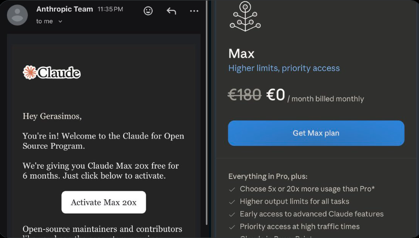
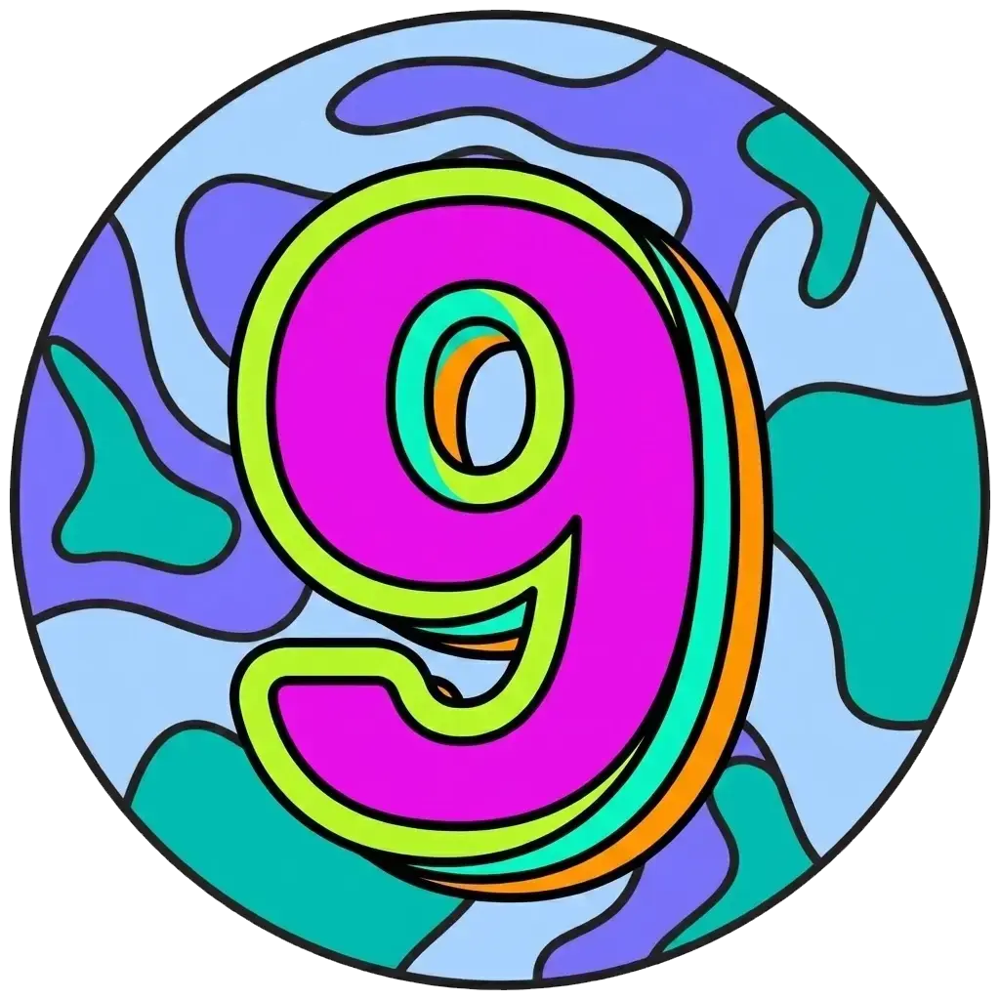

<picture>
  <source media="(prefers-color-scheme: dark)" srcset="assets/terminal-dark.svg">
  <source media="(prefers-color-scheme: light)" srcset="assets/terminal-light.svg">
  
</picture>

<p align="center">
  <a href="https://hellenic.dev"></a>
  <a href="https://plexon.ai"></a>
  <a href="https://iris-go.com"></a>
  <a href="https://github.com/sponsors/kataras"></a>
</p>

<p align="center">
  <a href="https://x.com/makismaropoulos"></a>
  <a href="https://gr.linkedin.com/in/gerasimos-maropoulos"></a>
  <a href="https://dev.to/kataras"></a>
  <a href="https://medium.com/@kataras"></a>
  <a href="https://instagram.com/makismaropoulos"></a>
  <a href="https://www.facebook.com/makismaropoulos"></a>
</p>


## What I am building

<table>
  <tr>
    <td valign="top" width="34%">
      <h3><a href="https://plexon.ai">Plexon AI</a></h3>
      <sub>CREATOR</sub>
      <p>Your assistant. Your apps. Your machine.<br>
      A desktop AI assistant for Windows, macOS and Linux. It does real work inside apps like Slack, Notion, Gmail and GitHub, and your files, API keys and chat history stay on your computer.</p>
      <a href="https://plexon.ai">plexon.ai</a> &middot; <a href="https://github.com/hellenic-development/plexon.ai">GitHub</a> &middot; <a href="https://plexon.ai/download/">Download</a>
    </td>
    <td valign="top" width="33%">
      <h3><a href="https://hellenic.dev">Hellenic Development</a></h3>
      <sub>FOUNDER &amp; CEO</sub>
      <p>A developer infrastructure company in Athens. We build Plexon AI, Iris, Hellenic Identity and Go clients for new kinds of AI model such as <a href="https://github.com/kataras/jev">jev</a>, and we take on consulting for teams in finance, healthcare and government, where data cannot leave the organisation.</p>
      <a href="https://hellenic.dev">hellenic.dev</a> &middot; <a href="https://github.com/hellenic-development">GitHub</a>
    </td>
    <td valign="top" width="33%">
      <h3><a href="https://www.pnoe.com">PNOE</a></h3>
      <sub>SENIOR BACKEND ENGINEER &amp; AI ARCHITECT</sub>
      <p>PNOE measures metabolism through breath analysis. I work on its backend and its AI architecture.</p>
      <a href="https://www.pnoe.com">pnoe.com</a>
    </td>
  </tr>
</table>


## Open source

<table>
  <tr>
    <td width="72" valign="top"><a href="https://github.com/kataras/iris"></a></td>
    <td valign="top">
      <h3><a href="https://github.com/kataras/iris">Iris Web Framework</a></h3>
      <p>A Go web framework, in development since 2016. Routing, MVC and dependency injection, sessions, websockets, i18n, and around 285 runnable examples. Several of the libraries below started life inside it.</p>
      <a href="https://github.com/kataras/iris/stargazers"></a>
      <a href="https://github.com/kataras/iris/network/members"></a>
      <a href="https://github.com/kataras/iris/releases"></a>
      <a href="https://github.com/kataras/iris/blob/main/go.mod"></a>
      <br><br>
      <a href="https://docs.iris-go.com">Docs</a> &middot; <a href="https://github.com/kataras/iris/tree/main/_examples">Examples</a> &middot; <a href="https://iris-go.com">iris-go.com</a>
    </td>
  </tr>
</table>

<table>
  <tr>
    <td valign="top">
      <h3><a href="https://github.com/kataras/jev">jev</a> <sub>NEW</sub></h3>
      <p><a href="https://typesafe.ai/blog/introducing-system-one-models-and-jev">Jev</a> is a new kind of model from TypeSafe AI, released in September 2026. It does not write text. You send it a state (a support ticket, a log line, a JSON document) and named questions, and it returns a typed answer with a calibrated probability for each one: yes or no, one option out of many, or a position on a scale. TypeSafe calls it a System One model, after Kahneman: fast, structured decisions that software acts on directly, around two orders of magnitude faster than asking an LLM the same thing. Since it never generates free text, there is nothing to hallucinate.</p>
      <p>TypeSafe ships JavaScript and Python SDKs. <code>jev</code> is the Go client, built at Hellenic Development. One dependency. Typed questions and answers, generics to decode a response into your own struct, sentinel errors, retries that match the official SDK, and a client-side token bucket that keeps you under both account limits (requests per minute and input tokens per second) instead of paying for 429s. JSON goes out byte for byte as you wrote it, through <code>encoding/json/v2</code>. It also ships as an Agent Skill for Claude Code, Cursor, Codex and Plexon.</p>
      <a href="https://github.com/kataras/jev/stargazers"></a>
      <a href="https://github.com/kataras/jev/actions"></a>
      <a href="https://github.com/kataras/jev/blob/main/go.mod"></a>
      <a href="https://github.com/kataras/jev/blob/main/LICENSE"></a>
      <br><br>
      <a href="https://pkg.go.dev/github.com/kataras/jev">Go docs</a> &middot; <a href="https://github.com/kataras/jev/blob/main/examples/quickstart/main.go">Quickstart</a> &middot; <a href="https://docs.typesafe.ai/introduction">TypeSafe docs</a>
    </td>
  </tr>
</table>

One call, three questions, one round trip:

```go
client, _ := jev.New() // reads TYPESAFE_API_KEY

resp, err := client.SystemOne(ctx, jev.Request{
    State: "I was charged twice. Fix this ASAP.",
    Questions: jev.Questions{
        "billing": jev.Noul{Instructions: "Is this about billing?"},
        "team": jev.Choice{
            Instructions: "Who should handle it?",
            Criteria:     map[string]any{"billing": "Payments, refunds", "technical": nil},
        },
        "urgency": jev.Score{
            Instructions: "How urgent is it?",
            Criteria:     []string{"can wait", "this week", "today"},
        },
    },
})

billing, _ := resp.Noul("billing")  // .Noul, a probability from 0 to 1
team, _ := resp.Choice("team")      // .Choice, .Probabilities, .Confidence
urgency, _ := resp.Score("urgency") // .Score, .Probabilities, .Confidence
```

<table>
  <tr>
    <td valign="top" width="34%">
      <a href="https://github.com/kataras/neffos"><b>neffos</b></a><br>
      <sub>Websocket framework for Go. Namespaces, rooms, acknowledgements, and a TypeScript client.</sub><br>
      
    </td>
    <td valign="top" width="33%">
      <a href="https://github.com/kataras/golog"><b>golog</b></a><br>
      <sub>Leveled logger for Go. Small API, fast, coloured output in the terminal.</sub><br>
      
    </td>
    <td valign="top" width="33%">
      <a href="https://github.com/kataras/muxie"><b>muxie</b></a><br>
      <sub>HTTP router and multiplexer for Go, compatible with <code>http.Handler</code>.</sub><br>
      
    </td>
  </tr>
  <tr>
    <td valign="top">
      <a href="https://github.com/kataras/go-sessions"><b>go-sessions</b></a><br>
      <sub>Session manager for net/http and fasthttp, with pluggable storage.</sub><br>
      
    </td>
    <td valign="top">
      <a href="https://github.com/kataras/jwt"><b>jwt</b></a><br>
      <sub>JWT signing and verification for Go, with generics for typed claims.</sub><br>
      
    </td>
    <td valign="top">
      <a href="https://github.com/kataras/rizla"><b>rizla</b></a><br>
      <sub>Watches, rebuilds and restarts your Go program while you edit.</sub><br>
      
    </td>
  </tr>
  <tr>
    <td valign="top">
      <a href="https://github.com/kataras/i18n"><b>i18n</b></a><br>
      <sub>Localization for Go. Loads YAML, TOML, JSON or INI translations, pluralization included.</sub><br>
      
    </td>
    <td valign="top">
      <a href="https://github.com/kataras/go-events"><b>go-events</b></a><br>
      <sub>EventEmitter for Go, modelled on the Node.js one.</sub><br>
      
    </td>
    <td valign="top">
      <a href="https://github.com/kataras/server-benchmarks"><b>server-benchmarks</b></a><br>
      <sub>Reproducible, cross-platform HTTP/2 benchmarks across web servers, 2020 to 2026.</sub><br>
      
    </td>
  </tr>
  <tr>
    <td valign="top">
      <a href="https://github.com/kataras/blocks"><b>blocks</b></a><br>
      <sub>View engine for Go on top of html/template, with layouts and blocks.</sub><br>
      
    </td>
    <td valign="top">
      <a href="https://github.com/kataras/pg"><b>pg</b></a><br>
      <sub>PostgreSQL for Go through struct entities, schema management and repositories.</sub><br>
      
    </td>
    <td valign="top">
      <a href="https://github.com/kataras/tunnel"><b>tunnel</b></a><br>
      <sub>Public URLs for exposing your local web server.</sub><br>
      
    </td>
  </tr>
  <tr>
    <td valign="top">
      <a href="https://github.com/kataras/hcaptcha"><b>hcaptcha</b></a><br>
      <sub>hCaptcha verification middleware for Go web servers.</sub><br>
      
    </td>
    <td valign="top">
      <a href="https://github.com/kataras/versioning"><b>versioning</b></a><br>
      <sub>Semantic API versioning for Go HTTP handlers.</sub><br>
      
    </td>
    <td valign="top">
      <a href="https://github.com/kataras/compress"><b>compress</b></a><br>
      <sub>HTTP compression for Go web applications.</sub><br>
      
    </td>
  </tr>
</table>

<p align="right"><sub>More small ones (sitemap, httpfs, rewrite, requestid, realip, methodoverride, pio, chronos) live in <a href="https://github.com/kataras?tab=repositories&type=source&sort=stargazers">the full list</a>.</sub></p>


## Writing

I have written on [dev.to](https://dev.to/kataras) since 2017 and on [Medium](https://medium.com/@kataras). The list below refreshes daily from the dev.to feed.

<!-- BLOG-POST-LIST:START -->- [I ran $24,000 of Claude through my terminal in August. Here is what it built.](https://dev.to/kataras/i-ran-24000-of-claude-through-my-terminal-in-august-here-is-what-it-built-37h5) <sub>Sep 13, 2026</sub>
- [Introducing llms.txt — AI Transparency for the Iris Web Framework](https://dev.to/kataras/introducing-llmstxt-ai-transparency-for-the-iris-web-framework-4af) <sub>Sep 13, 2025</sub>
- [RFC: HTTP Wire Errors](https://dev.to/kataras/rfc-http-wire-errors-48jc) <sub>Dec 1, 2024</sub>
- [HTTP Method Override](https://dev.to/kataras/http-method-override-1b6p) <sub>Nov 8, 2024</sub>
- [Request Body Limit Middleware for Iris](https://dev.to/kataras/request-body-limit-middleware-for-iris-4999) <sub>Nov 1, 2024</sub>
- [Basic Authentication Middleware for Iris](https://dev.to/kataras/basic-authentication-middleware-for-iris-42k8) <sub>Oct 31, 2024</sub>
<!-- BLOG-POST-LIST:END -->

Older pieces people still find useful:

- [Go vs .NET Core in terms of HTTP performance](https://medium.com/hackernoon/go-vs-net-core-in-terms-of-http-performance-7535a61b67b8)
- [Iris Go vs .NET Core Kestrel in terms of HTTP performance](https://medium.com/hackernoon/iris-go-vs-net-core-kestrel-in-terms-of-http-performance-806195dc93d5)
- [A URL Shortener Service using Go, Iris and Bolt](https://dev.to/kataras/a-url-shortener-service-using-go-iris-and-bolt-3h9m)
- [A Todo MVC Application using Iris and Vue.js](https://medium.com/hackernoon/a-todo-mvc-application-using-iris-and-vue-js-5019ff870064)


## Recognition

<table>
  <tr>
    <td valign="top" width="50%">
      <a href="https://x.com/MakisMaropoulos/status/2028949824230371798"></a>
    </td>
    <td valign="top" width="50%">
      <h3>Claude for Open Source Program</h3>
      <p>Anthropic accepted me into the Claude for Open Source Program in July 2026, for the work on Iris: six months of Claude Max 20x. <a href="https://x.com/MakisMaropoulos/status/2028949824230371798">The post on X</a>.</p>
      <h3>DEV Community</h3>
      <p>
        <a href="https://dev.to/kataras"></a>
        <a href="https://dev.to/kataras"></a>
        <a href="https://dev.to/kataras"></a>
      </p>
      <sub>Top 7 article of the week, nine years as a member, and the badge for the first post.</sub>
    </td>
  </tr>
</table>


> Writing code is hard, it's difficult because it requires isolation, you have to banish any noise, anything that can disorient you, it's like you have to wear blindfolds to write. It is very lonely, it is a process that comes and isolates you from friends, from family, FROM LIFE ITSELF - this is how I perceive it, if you want to do it right. I can start something with enthusiasm and then I go into the process of judging it very strictly and what I liked on Monday, on Tuesday I no longer like. It is a difficult process but in the end it always makes you proud.
>
> <sub><a href="https://www.facebook.com/makismaropoulos/posts/10224965766197770">G.M.</a></sub>

<p align="center">
  <a href="https://github.com/kataras?tab=followers"></a>
  <a href="https://github.com/kataras?tab=repositories&type=source&sort=stargazers"></a>
  <a href="https://github.com/kataras/iris"></a>
</p>
